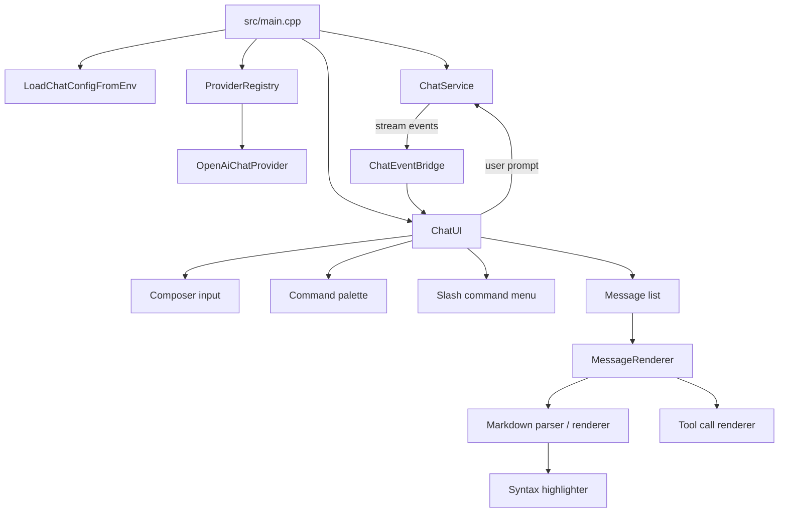

# YAC

Yet Another Chat is a C++20 terminal chat client built on FTXUI. It combines an
OpenAI-compatible streaming chat service with a presentation layer for
Markdown-heavy responses, command UI, and structured tool-call rendering.

## Preview

The SVG previews show the current chat surface and command palette.


## Snapshot

| Piece | What it does |
| --- | --- |
| `yac` | Fullscreen terminal app |
| `yac_app` | Bridges chat service events into `ChatUI` updates |
| `yac_service` | Queues prompts, tracks history, and streams provider responses |
| `yac_presentation` | FTXUI components, Markdown rendering, theming, and tool cards |
| Provider | OpenAI-compatible `/chat/completions` streaming via libcurl |
| Config | Environment variables or `.env` in the current working directory |

## Highlights

- Streaming assistant responses with status updates, cancellation, and prompt
  queue handling
- OpenAI-compatible provider configuration for model, base URL, API key
  variable, temperature, and system prompt
- Rich Markdown rendering for headings, lists, blockquotes, links, inline code,
  fenced code blocks, bold, italic, and strikethrough
- Keyword-based syntax highlighting for C++, Python, JavaScript, and Rust
- Structured tool-call rendering for bash, file edit, file read, grep, glob,
  web fetch, and web search blocks
- Scrollable transcript with cached Markdown parsing and rendered elements for
  smoother redraws
- Command palette plus slash command autocomplete for `/quit` and `/exit`

## Quick Start

### Configure

```bash
cmake -B build -G Ninja -DCMAKE_BUILD_TYPE=Debug
```

### Build

```bash
cmake --build build
```

### Run

```bash
export OPENAI_API_KEY=sk-...
./build/yac
```

If the API key is missing, the app still starts and reports the provider error
in the chat when a request is submitted.

## Configuration

YAC reads process environment variables first, then falls back to a `.env` file
in the current working directory.

| Variable | Default | Purpose |
| --- | --- | --- |
| `YAC_PROVIDER` | `openai` | Provider ID registered by the app |
| `YAC_MODEL` | `gpt-4o-mini` | Model sent to the chat completions endpoint |
| `YAC_BASE_URL` | `https://api.openai.com/v1/` | OpenAI-compatible API base URL |
| `YAC_TEMPERATURE` | `0.7` | Sampling temperature from `0.0` to `2.0` |
| `YAC_API_KEY_ENV` | `OPENAI_API_KEY` | Name of the variable containing the API key |
| `YAC_SYSTEM_PROMPT` | unset | Optional system prompt prepended to requests |

Example `.env`:

```dotenv
OPENAI_API_KEY=sk-...
YAC_MODEL=gpt-4o-mini
YAC_TEMPERATURE=0.7
YAC_SYSTEM_PROMPT="Use concise answers."
```

Keep `YAC_PROVIDER=openai` unless you add and register another provider in code.
To point at a compatible API, set `YAC_BASE_URL` and optionally
`YAC_API_KEY_ENV`.

## Usage

The interface is keyboard-first:

- `Enter` sends the current message
- `Shift+Enter`, `Ctrl+Enter`, and `Alt+Enter` insert a newline in the composer
- `Ctrl+P` opens the command palette
- `Escape` closes the command palette or slash command menu
- `Up` and `Down` move through palette or slash command results
- `Tab` moves upward through slash command results
- `Enter` in a command menu runs the selected command
- Typing `/` opens slash command autocomplete; `/quit` and `/exit` close YAC
- `PageUp` and `PageDown` scroll the transcript by a page
- `Home` jumps to the top of the chat history
- `End` jumps to the bottom
- Mouse wheel and scrollbar dragging also work for transcript navigation

The command palette filters by case-insensitive substring matching across both
name and description.

## Tests

List discovered tests first:

```bash
ctest --test-dir build -N
```

Run the full suite:

```bash
ctest --test-dir build --output-on-failure
```

Run one test by name:

```bash
ctest --test-dir build -R "^ATX heading level 1$" --output-on-failure
```

## Quality Tools

```bash
cmake --build build --target format
cmake --build build --target lint
```

## Project Map

- `src/main.cpp` loads config, registers the OpenAI-compatible provider, wires
  callbacks, and starts the fullscreen FTXUI loop
- `src/app/chat_event_bridge.*` translates service events into presentation
  updates
- `src/chat/` contains chat config loading, `.env` parsing, queueing, history,
  cancellation, and stream event flow
- `src/provider/` contains the provider interface, registry, and OpenAI
  chat-completions implementation
- `src/presentation/chat_ui.*` owns messages, input handling, scrolling, command
  palette, and slash command menu state
- `src/presentation/message_renderer.*` renders messages, using cached Markdown
  blocks when available
- `src/presentation/markdown/` contains the custom parser and renderer
- `src/presentation/syntax/` contains the keyword-based syntax highlighter
- `src/presentation/tool_call/` contains tool-call types and their renderer
- `src/presentation/theme.*` defines the shared color system
- `src/presentation/util/` contains header-only helpers for scrolling, string
  utilities, and relative time

## Architecture



## Notes

- Dependencies are fetched by CMake with `FetchContent`.
- `FTXUI` and `openai-cpp` track upstream `main`; `Catch2` is pinned to
  `v3.5.2`.
- libcurl is required for the OpenAI-compatible streaming provider.
- `build/compile_commands.json` is generated during configure and is used by
  `.clangd`.
- The `format` and `lint` targets rely on CMake source globbing, so reconfigure
  after adding or renaming source files.
