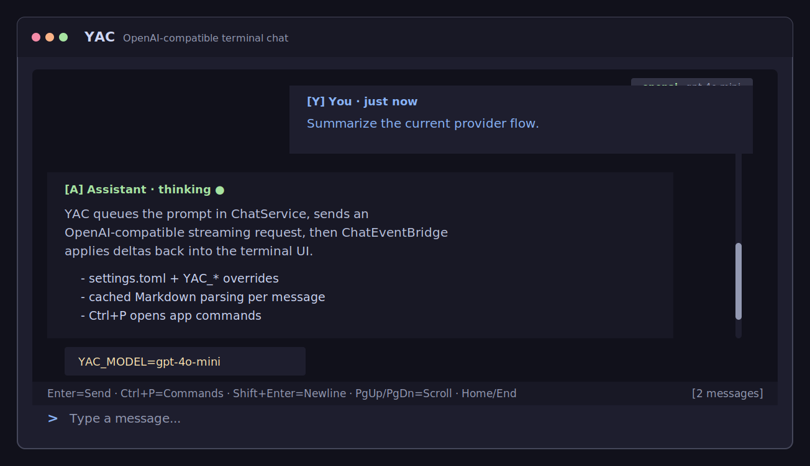
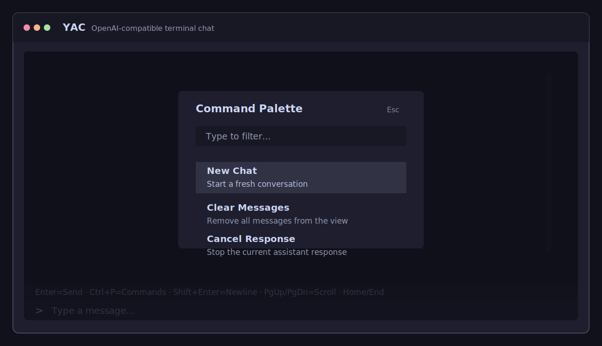
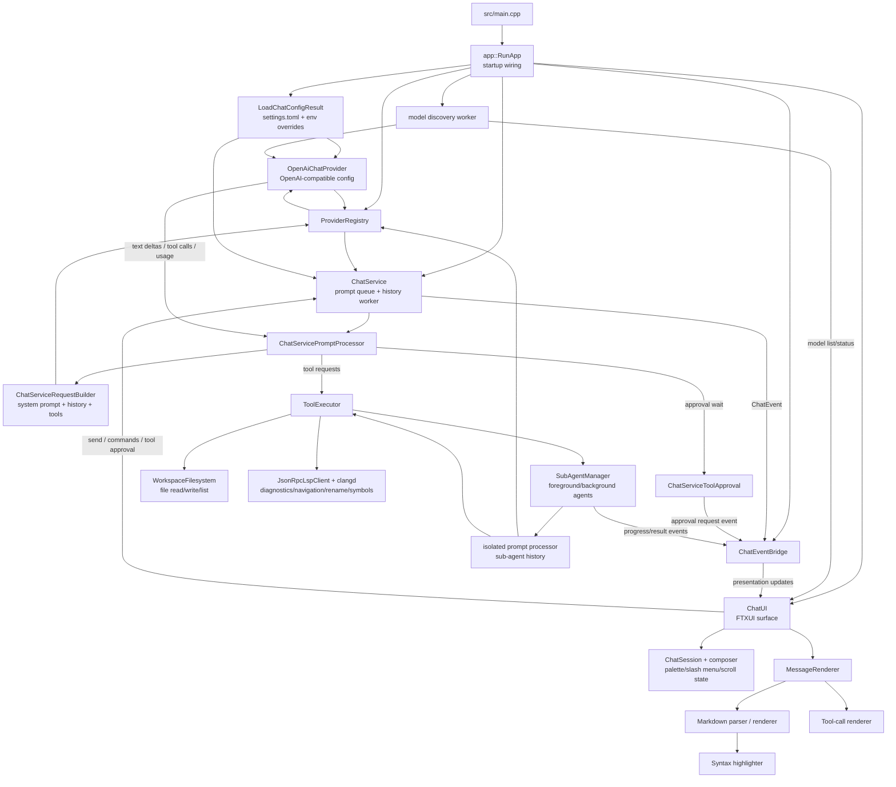

# YAC

Yet Another Chat is a C++20 terminal chat client built on FTXUI. It combines an
OpenAI-compatible streaming chat service with a presentation layer for
Markdown-heavy responses, command UI, and structured tool-call rendering.

## Preview

The SVG previews show the current chat surface and command palette.





## Snapshot

| Piece | What it does |
| --- | --- |
| `yac` | Fullscreen terminal app |
| `yac_app` | Bridges chat service events into `ChatUI` updates |
| `yac_service` | Queues prompts, tracks history, and streams provider responses |
| `yac_presentation` | FTXUI components, Markdown rendering, theming, and tool cards |
| Provider | OpenAI-compatible `/chat/completions` streaming via libcurl, with `openai-compatible` and `zai` presets |
| Config | `~/.yac/settings.toml`, with `YAC_*` environment variable overrides |

## Highlights

- Streaming assistant responses with status updates, cancellation, and prompt
  queue handling
- OpenAI-compatible provider configuration for model, base URL, API key
  variable, temperature, and system prompt
- Z.ai Coding API preset with startup model discovery and command-palette model
  switching
- First-run setup status for provider/model, workspace, API key, and clangd
  availability
- Rich Markdown rendering for headings, lists, blockquotes, links, inline code,
  fenced code blocks, bold, italic, and strikethrough
- Keyword-based syntax highlighting for C++, Python, JavaScript, and Rust
- Structured tool-call rendering for file reads/writes, directory listings, LSP
  diagnostics/navigation/rename/symbols, and legacy bash/search-style blocks
- `file_edit` tool for surgical string-replacement edits with human approval,
  avoiding full-file overwrites
- `grep` tool for ripgrep-backed content search across the workspace, with
  filename and line-number output
- `glob` tool for native filesystem walks with gitignore filtering, returning
  paths sorted by modification time
- Scrollable transcript with cached Markdown parsing and rendered elements for
  smoother redraws
- Command palette plus slash command autocomplete for help, clear, cancel,
  task, and quit commands
- User-defined predefined prompt commands loaded from `~/.yac/prompts/*.toml`,
  with seeded `/init` and `/review` prompts
- Selectable theme presets (`vivid`, `system`) with a bright, high-saturation
  visual language built around semantic color roles

## Quick Start

### Configure

```bash
cmake -B build -G Ninja -DCMAKE_BUILD_TYPE=Debug
```

### Build

```bash
cmake --build build
```

### Run

```bash
export OPENAI_API_KEY=sk-...
./build/yac
```

If the API key is missing, the app still starts and shows the setup warning in
the empty transcript. Requests still surface the provider error in chat if the
key remains unset.

## Configuration

YAC reads `~/.yac/settings.toml`. On first launch the file is auto-created with
a commented default template; edit it and restart to pick up changes. At
startup, shell environment variables named `YAC_*` override whatever is in the
file, which is useful for CI, per-shell experiments, and quick flips.

YAC also reads predefined prompts from `~/.yac/prompts/*.toml` at startup. The
directory is auto-created, and missing `init.toml` and `review.toml` files are
seeded from pinned OpenCode prompt templates. Each TOML file becomes a slash
command named from the file stem, such as `~/.yac/prompts/review.toml` becoming
`/review`. Built-in slash commands keep priority if a prompt file name
collides.

API keys are resolved from `provider.api_key` when set; otherwise YAC reads the
environment variable named by `provider.api_key_env`.

Example `~/.yac/settings.toml`:

```toml
temperature = 0.7
# system_prompt = "You are a helpful assistant."

[provider]
id          = "openai-compatible"
model       = "gpt-4o-mini"
base_url    = "https://api.openai.com/v1/"
api_key_env = "OPENAI_API_KEY"

[lsp.clangd]
command = "clangd"
args    = []
```

| Setting | Env override | Default | Purpose |
| --- | --- | --- | --- |
| `provider.id` | `YAC_PROVIDER` | `openai-compatible` | Provider ID registered by the app |
| `provider.model` | `YAC_MODEL` | `gpt-4o-mini` | Model sent to the chat completions endpoint |
| `provider.base_url` | `YAC_BASE_URL` | `https://api.openai.com/v1/` | OpenAI-compatible API base URL |
| `provider.api_key_env` | `YAC_API_KEY_ENV` | `OPENAI_API_KEY` | Name of the env var holding the secret |
| `provider.api_key` | — | unset | Optional inline key; prefer the configured env var |
| `temperature` | `YAC_TEMPERATURE` | `0.7` | Sampling temperature from `0.0` to `2.0` |
| `system_prompt` | `YAC_SYSTEM_PROMPT` | unset | Optional system prompt prepended to requests |
| `workspace_root` | `YAC_WORKSPACE_ROOT` | launch CWD | Root directory for workspace-scoped tools |
| `lsp.clangd.command` | `YAC_LSP_CLANGD_COMMAND` | `clangd` | LSP server command |
| `lsp.clangd.args` | `YAC_LSP_CLANGD_ARGS` | `[]` | LSP server arguments |
| `mcp.servers[].{command,args,url,enabled,auth.api_key_env}` | `YAC_MCP_<ID>_COMMAND`, `YAC_MCP_<ID>_ARGS`, `YAC_MCP_<ID>_URL`, `YAC_MCP_<ID>_ENABLED`, `YAC_MCP_<ID>_API_KEY_ENV` | unset | Override an existing MCP server by ID (`<ID>` = upper snake case, non-alnum → `_`) |
| `theme.name` | `YAC_THEME_NAME` | `"vivid"` | Active theme preset (`vivid`, `system`) |
| `theme.density` | `YAC_THEME_DENSITY` | `"comfortable"` | Theme density: `"comfortable"` (normal spacing) or `"compact"` (tighter) |
| `compact.auto_enabled` | `YAC_COMPACT_AUTO_ENABLED` | `true` | Auto-compact history before each new user prompt when usage crosses `compact.threshold` |
| `compact.threshold` | `YAC_COMPACT_THRESHOLD` | `0.8` | Fraction of context window (0.05–1.0) at which auto-compact fires |
| `compact.keep_last` | `YAC_COMPACT_KEEP_LAST` | `20` | Most-recent non-system messages preserved through compaction |
| `compact.mode` | `YAC_COMPACT_MODE` | `"summarize"` | `"summarize"` (LLM-summarized) or `"truncate"` (drop and insert a synthetic note) |

Set `[provider].id = "zai"` (or `YAC_PROVIDER=zai`) to use the Z.ai Coding API
preset. When only `id` is set, the preset fills in `glm-5.1`,
`https://api.z.ai/api/coding/paas/v4`, and `ZAI_API_KEY`; any field you set
explicitly overrides the preset.

API keys: prefer exporting `OPENAI_API_KEY` / `ZAI_API_KEY` in your shell over
placing `api_key` in the TOML file. Plaintext secrets in `$HOME` are harder to
rotate safely and don't travel well across shells or CI.

Example `~/.yac/prompts/review.toml`:

```toml
description = "Review current changes"
prompt = """
Review the requested target:
$ARGUMENTS
"""
```

Command arguments replace every literal `$ARGUMENTS` token in the prompt body.
For example, `/review main` sends the rendered prompt with `main` substituted.
Prompt files are loaded on startup, so restart YAC after editing them.

YAC shows the active provider/model in the footer. It starts the UI immediately,
then fetches models in the background and adds a `Switch Model` command when a
model list is available. If Z.ai discovery fails, YAC falls back to a built-in
GLM model list seeded with `glm-5.1`.

## Usage

The interface is keyboard-first:

- `Enter` sends the current message
- `Shift+Enter`, `Ctrl+Enter`, and `Alt+Enter` insert a newline in the composer
- `Shift+Tab` toggles between plan and build mode
- `Ctrl+P` opens the command palette
- `Help` opens shortcuts, setup status, and workspace status
- `Switch Model` opens the model picker for future responses
- `Escape` closes the command palette or slash command menu
- `Up` and `Down` move through palette or slash command results
- `Tab` moves upward through slash command results
- `Enter` in a command menu runs the selected command
- Typing `/` opens slash command autocomplete; `/help`, `/?`, `/clear`,
  `/cancel`, `/task <description>`, `/quit`, and `/exit` are built in
- `/init` and `/review` are seeded predefined prompts; add more by placing
  TOML files in `~/.yac/prompts`
- `PageUp` and `PageDown` scroll the transcript by a page
- `Home` jumps to the top of the chat history
- `End` jumps to the bottom
- Mouse wheel and scrollbar dragging also work for transcript navigation

The command palette filters by case-insensitive substring matching across both
name and description. It includes `New Chat`, `Clear Messages`,
`Cancel Response`, and `Help`; `Switch Model` appears when model discovery has
at least one model.

## MCP Integration

YAC supports the [Model Context Protocol](https://modelcontextprotocol.io/specification/2025-11-25/)
(version 2025-11-25), letting you connect external tool servers over stdio or
HTTP. Connected servers expose their tools directly to the assistant, which
calls them the same way it calls built-in tools.

See **[docs/mcp.md](docs/mcp.md)** for the full reference: config schema,
OAuth flow, token storage, approval policy, resource lookup, and
troubleshooting.

### Quick setup

Add a stdio server (e.g. Context7 via npx) to `~/.yac/settings.toml`:

```toml
[[mcp.servers]]
id        = "context7"
transport = "stdio"
command   = "npx"
args      = ["-y", "@upstash/context7-mcp"]
enabled   = true
```

Or register it from the CLI without editing the file:

```bash
yac mcp add context7 --transport stdio --command npx --args '-y,@upstash/context7-mcp'
```

From inside the TUI, use `/mcp add` instead. List configured servers with
`yac mcp list` (CLI) or `/mcp list` (TUI). Authenticate an OAuth server with
`yac mcp auth <server-id>`.

Tool names follow the pattern `mcp_<server-id>__<tool-name>` (double
underscore). The assistant picks them up automatically once the server starts.

## Tests

List discovered tests first:

```bash
ctest --test-dir build -N
```

Run the full suite:

```bash
ctest --test-dir build --output-on-failure
```

Run one test by name:

```bash
ctest --test-dir build -R "^ATX heading level 1$" --output-on-failure
```

## Quality Tools

```bash
cmake --build build --target format
cmake --build build --target lint
cmake --build build --target format-check
```

## Project Map

- `src/main.cpp` is a thin handoff to app bootstrap; it loads config, registers the OpenAI-compatible provider, and wires minimal startup hooks, delegating full startup orchestration to the app bootstrap component
- `src/app/chat_event_bridge.*` translates service events into presentation
  updates
- `src/chat/` contains chat config loading (`~/.yac/settings.toml` + env var
  overrides), predefined prompt loading (`~/.yac/prompts/*.toml`), queueing,
  history, cancellation, and stream event flow
- `src/provider/` contains the provider interface, registry, and OpenAI
  chat-completions implementation
- `src/presentation/chat_ui.*` owns messages, input handling, scrolling, command
  palette, and slash command menu state
- `src/presentation/message_renderer.*` renders messages, using cached Markdown
  blocks when available
- `src/presentation/markdown/` contains the custom parser and renderer
- `src/presentation/syntax/` contains the keyword-based syntax highlighter
- `src/presentation/tool_call/` contains tool-call types and their renderer
- `src/presentation/theme.*` defines the shared color system
- `src/presentation/util/` contains header-only helpers for scrolling, string
  utilities, and relative time

## Architecture



## Notes

- The `grep` tool requires ripgrep (`rg`) in PATH. Install: `apt install ripgrep` or `brew install ripgrep`.
- Dependencies are fetched by CMake with `FetchContent`.
- `FTXUI` and `openai-cpp` are pinned to specific commits and are not tracking upstream `main`.
- `Catch2` is pinned to `v3.5.2`.
- `hrantzsch/keychain` is fetched at `v1.3.1`; on Linux it uses `libsecret-1-dev` and DBus.
- libcurl is required for the OpenAI-compatible streaming provider.
- `build/compile_commands.json` is generated during configure and is used by
  `.clangd`.
- The `format` and `lint` targets rely on CMake source globbing, so reconfigure
  after adding or renaming source files.
