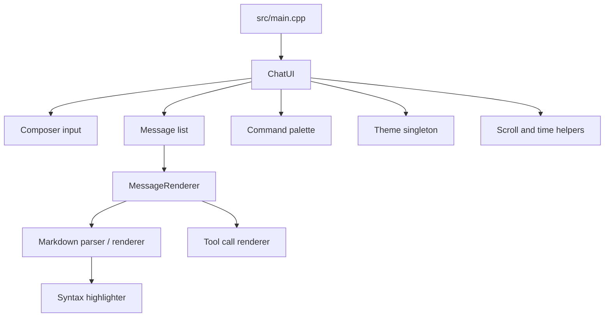

# YAC

Yet Another Chat is a C++20 terminal chat UI built on FTXUI. It focuses on
rendering conversations well: markdown-heavy assistant replies, structured
tool calls, modal UI, and a theme system that keeps the interface readable in a
terminal.

## Preview

The captures below come from the app's own render path and are stored as SVG so
they stay sharp in the README.


## Snapshot

| Piece | What it does |
| --- | --- |
| `yac` | Fullscreen terminal app |
| `yac_presentation` | Presentation layer library |
| Markdown | Custom parser and FTXUI renderer |
| Tool calls | Structured rendering for bash, file, grep, glob, and web blocks |
| UI chrome | Command palette, dialogs, collapsible sections, and theming |

## Highlights

- Rich markdown rendering for headings, lists, blockquotes, links, inline code,
  fenced code blocks, bold, italic, and strikethrough
- Keyword-based syntax highlighting for C++, Python, JavaScript, and Rust
- Scrollable chat transcript with distinct user, agent, and tool message
  styling
- Cached message parsing and element rendering for smoother redraws
- Modal command palette and reusable dialog/collapsible components
- Demo startup transcript that exercises the renderer and tool-call formats

## Usage

The interface is intentionally keyboard-first:

- `Enter` sends the current message
- `Shift+Enter`, `Ctrl+Enter`, and `Alt+Enter` insert a newline in the composer
- `Ctrl+P` opens the command palette
- `Escape` closes the command palette without selecting anything
- `Up` and `Down` move through palette results
- `Enter` in the palette runs the selected command and closes the overlay
- `PageUp` and `PageDown` scroll the transcript by a page
- `Home` jumps to the top of the chat history
- `End` jumps to the bottom
- Mouse wheel and scrollbar dragging also work for transcript navigation

The palette filters commands by case-insensitive substring matching across both
name and description, so it stays useful even with a short list.

## Quick Start

### Configure

```bash
cmake -B build -G Ninja -DCMAKE_BUILD_TYPE=Debug
```

### Build

```bash
cmake --build build
```

### Run

```bash
./build/yac
```

## Tests

List discovered tests first:

```bash
ctest --test-dir build -N
```

Run the full suite:

```bash
ctest --test-dir build --output-on-failure
```

Run one test by name:

```bash
ctest --test-dir build -R "^ATX heading level 1$" --output-on-failure
```

## Quality Tools

```bash
cmake --build build --target format
cmake --build build --target lint
```

## Project Map

- `src/main.cpp` seeds the demo transcript and starts the fullscreen FTXUI app
- `src/presentation/chat_ui.*` owns messages, input handling, scrolling, and
  the command palette
- `src/presentation/message_renderer.*` renders messages, using cached markdown
  blocks when available
- `src/presentation/markdown/` contains the custom parser and renderer
- `src/presentation/syntax/` contains the keyword-based syntax highlighter
- `src/presentation/tool_call/` contains tool-call types and their renderer
- `src/presentation/theme.*` defines the shared color system
- `src/presentation/util/` contains header-only helpers for scrolling, string
  utilities, and relative time

## Architecture



## Notes

- Dependencies are fetched by CMake with `FetchContent`.
- `FTXUI` tracks upstream `main`; `Catch2` is pinned to `v3.5.2`.
- `build/compile_commands.json` is generated during configure and is used by
  `.clangd`.
- The `format` and `lint` targets rely on CMake source globbing, so reconfigure
  after adding or renaming source files.
