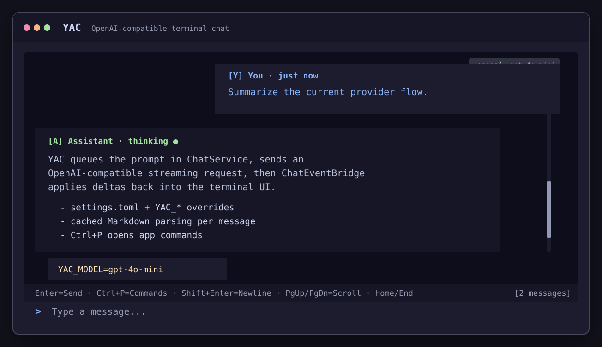
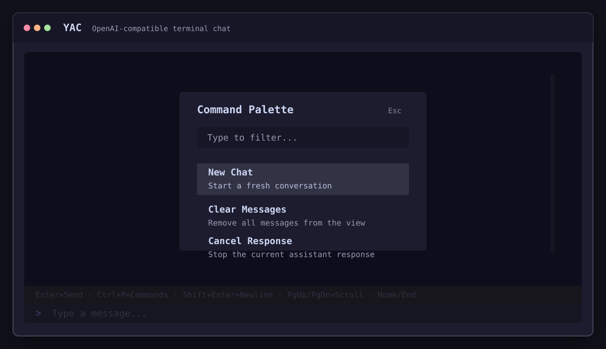

# YAC

Yet Another Chat is a C++20 terminal chat client built on FTXUI. It provides a
keyboard-first chat surface for OpenAI-compatible streaming providers, structured
tool calls, MCP servers, Markdown-heavy responses, and headless automation.

## Preview





## Highlights

- Streaming chat with cancellation, prompt queueing, usage reporting, and model
  switching.
- Providers for OpenAI-compatible chat completions, OpenAI stored auth, Z.ai,
  and AWS Bedrock.
- Markdown rendering, syntax highlighting, command palette, slash commands, and
  file mentions.
- Built-in tools for filesystem reads/writes, precise edits, ripgrep search,
  globbing, LSP navigation, sub-agents, and TODO tracking.
- MCP over stdio or HTTP, with OAuth, bearer auth, approval policy, resources,
  and admin commands.
- Plan and Build modes for separating planning from code-changing work.

## Quick Start

Install Bazelisk or a `bazel` binary that honors `.bazelversion`, plus
`ripgrep` for the built-in `grep` tool.

```bash
bazel build //src:yac
export OPENAI_API_KEY=sk-...
bazel run //src:yac
```

Headless and admin entrypoints use the same binary:

```bash
bazel run //src:yac -- run "prompt"
bazel run //src:yac -- run "prompt" --auto-approve
bazel run //src:yac -- run "prompt" --cancel-after-ms=5000
bazel run //src:yac -- mcp list
```

For release builds:

```bash
bazel build --config=release //src:yac
```

## Configuration

YAC reads `~/.yac/settings.toml`, creating it from the built-in template on
first launch. The repo copy, [settings.example.toml](settings.example.toml),
shows the supported shape. Shell env vars named `YAC_*` override TOML at
startup.

Common provider fields are `provider.id`, `provider.model`,
`provider.base_url`, and `provider.api_key_env`; matching env overrides include
`YAC_PROVIDER`, `YAC_MODEL`, `YAC_BASE_URL`, and `YAC_API_KEY_ENV`. Use
`OPENAI_API_KEY` or `ZAI_API_KEY` for API keys instead of plaintext TOML.
Bedrock uses provider options such as `provider.options.region` and
`provider.options.max_tokens`, with `YAC_BEDROCK_REGION` and
`YAC_BEDROCK_MAX_TOKENS` overrides.

OpenAI browser auth uses the fixed callback
`http://localhost:1455/auth/callback`. For headless shells, an installed binary
can run `yac auth openai login --device`; with Bazel, run
`bazel run //src:yac -- auth openai login --device`.

Full references:

- [Configuration](docs/configuration.md)
- [OpenAI auth](docs/openai-auth.md)
- [MCP](docs/mcp.md)

## Usage

In the TUI, `Enter` sends, `Shift+Enter` inserts a newline, `Ctrl+P` opens the
command palette, and `Shift+Tab` switches between Plan and Build modes. Slash
commands include `/help`, `/clear`, `/cancel`, `/task`, `/mcp`, `/auth`, `/quit`,
OpenAI `/effort` when supported by the active model, and prompt files loaded
from `~/.yac/prompts/*.toml`.

Plan mode writes the active plan under `.opencode/plans/*.md`. When planning is
complete, the assistant calls `plan_exit`; approving it writes the plan and
switches the session to Build.

See [Usage](docs/usage.md) for shortcuts, slash commands, headless mode, and
Plan/Build behavior.

## Development

```bash
bazel test //tests:all_tests
bazel test //tools:format_check
bazel run //tools:lint
bazel run //tools:refresh_compile_commands
```

Use `bazel run //tools:format` to apply formatting and
`bazel run //tools:coverage` for the PR coverage report. See
[CONTRIBUTING.md](CONTRIBUTING.md) for contributor setup and
[Architecture](docs/architecture.md) for the project map.

## License

YAC is licensed under the Apache License, Version 2.0. See [LICENSE](LICENSE)
for full text.
