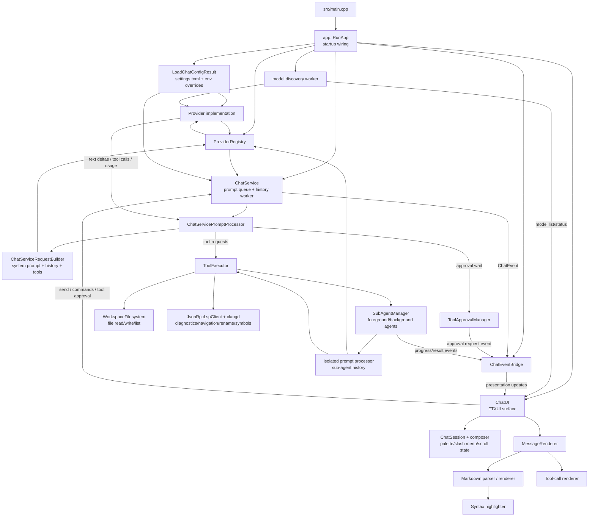

# Architecture

YAC is organized as a small executable over four Bazel library targets:

```text
src/main.cpp -> yac::app::RunApp()       # TUI
             -> yac::app::RunHeadless()  # yac run ...
             -> yac::cli::RunMcpCli()    # yac mcp ...
```

## Bazel Targets

- `//src:core_types`: shared IDs, tool-call types, agent mode, and MCP
  interfaces.
- `//src:presentation`: FTXUI components, Markdown parser and renderer, syntax
  highlighter, theme, command UI, and tool-call cards.
- `//src:service`: chat service, prompt processor, request builder, tool
  executors, MCP transport and manager, OAuth, provider registry, config
  loading, and CLI admin logic.
- `//src:app`: bootstrap, event bridge, model discovery, headless runner,
  provider factory, slash command handlers, and streaming coalescer.
- `//src:yac`: thin executable linking the app target.

## Project Map

- `src/main.cpp` is the executable handoff to app bootstrap.
- `src/app/` owns startup orchestration, event bridging, headless mode, and
  command handlers.
- `src/chat/` owns config loading, prompt libraries, queueing, history,
  compaction, cancellation, sub-agents, approvals, and stream flow.
- `src/provider/` contains provider interfaces and OpenAI-compatible, OpenAI
  auth, Z.ai context-window, and Bedrock implementations.
- `src/presentation/` owns FTXUI UI state, input handling, scrolling, command
  palette, slash menus, Markdown, syntax highlighting, themes, and rendered
  tool cards.
- `src/tool_call/` implements built-in tool executors and argument handling.
- `src/mcp/` implements MCP config, transports, OAuth, token storage, resources,
  tool naming, and manager/session lifecycle.
- `tests/` contains Catch2 unit tests, helper binaries, and deterministic
  integration tests.

## Flow



## Dependency Notes

Dependencies are resolved by Bazel/Bzlmod. FTXUI, openai-cpp, tomlplusplus,
Catch2, keychain, curl, BoringSSL, and the AWS Bedrock SDK overlay are pinned in
`MODULE.bazel` and `third_party/`.

`compile_commands.json` is generated with:

```bash
bazel run //tools:refresh_compile_commands
```
